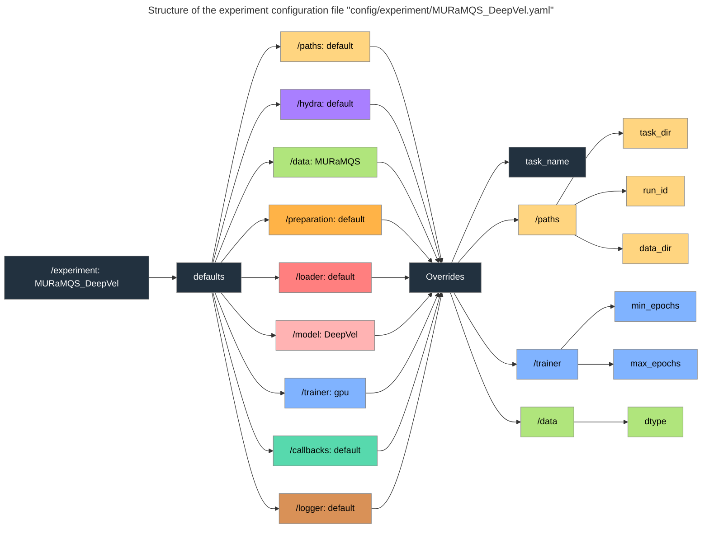
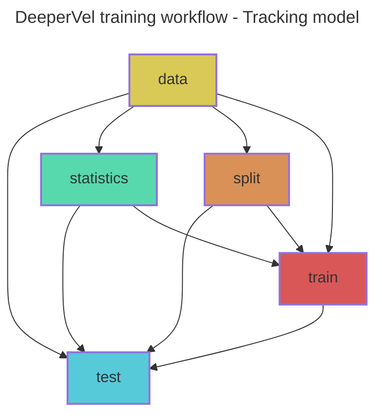

# DeeperVel 
A unified, automated, and reproducible framework for deep learning-based velocity (or other physical quantities of interest) reconstructions from observations.

## Table of Contents
- [Installation](#installation)
- [Usage](#usage)
  - [Experiment configuration](#experiment-configuration)
  - [Manual execution of individual steps](#manual-execution-of-individual-steps)
  - [Automated workflow (recommended)](#automated-workflow-recommended)
- [Documentation](#documentation)
- [References and Acknowledgements](#references-and-acknowledgements)

# Installation

Clone the repository:

```bash
git clone https://github.com/tremblaybenoit/DeeperVel.git
```
DeeperVel is built with [PyTorch Lightning](https://lightning.ai/docs/pytorch/stable/) and [Hydra](https://hydra.cc/docs/intro/). 

Create a new conda environment and install pre-requisites from [`environment.yaml`](environment.yaml):
```bash
conda create -n deepervel python=3.10
conda activate deepvervel
conda env update -f environment.yaml
```

# Usage
## Experiment configuration
Create or edit a configuration file in the [`config/experiment`](config/experiment) folder to set your experiment parameters.

1. Start with the `defaults` section to set the default configurations:
    - `paths` (from folder [`config/paths`](config/paths)): Directories for data and outputs.
    - `hydra` (from folder [`config/hydra`](config/hydra)): Hydra settings.
    - `data` (from folder [`config/data`](config/data)): Dataset parameters.
    - `preparation` (from folder [`config/preparation`](config/preparation)): Data preparation steps.
    - `loader` (from folder [`config/loader`](config/loader)): Data loading parameters.
    - `model` (from folder [`config/model`](config/model)): Model architecture and parameters.
    - `trainer` (from folder [`config/trainer`](config/trainer)): Training parameters.
    - `callbacks` (from folder [`config/callbacks`](config/callbacks)): Callbacks during training.
    - `logger` (from folder [`config/logger`](config/logger)): Logging parameters.
2. Add `overrides` below the `defaults` to change specific default parameters as needed. 

**Note**: The order of the `defaults` matters, as later entries can override earlier ones.

**Example**: The following diagram illustrates the structure of [`config/experiment/MURaMQS_DeepVel.yaml`](config/experiment/MURaMQS_DeepVel.yaml). 
It sets the `defaults` and then performs parameter `overrides`.


## Manual execution of individual steps
Each step of the workflow can be run manually using the corresponding Python script and 
experiment configuration.

1. Configure directories:
```bash
python -m config.setup -overrides "+experiment=MURaMQS_DeepVel"
```
2. Prepare data for the tracking model training:
```bash
python -m track.data.colocate +experiment=MURaMQS_DeepVel
python -m track.data.statistics +experiment=MURaMQS_DeepVel
```
3. Train the tracking model:
```bash
python -m track.train +experiment=MURaMQS_DeepVel
```
4. Test and evaluate the tracking model:
```bash
python -m track.test +experiment=MURaMQS_DeepVel
python -m track.evaluation.validation +experiment=MURaMQS_DeepVel
```
5. Predict using the tracking model:
```bash
python -m track.predict +experiment=MURaMQS_DeepVel
```

## Automated workflow (recommended)
DeeperVel uses the [Snakemake workflow management system](https://snakemake.readthedocs.io/en/stable/) for reproducibility.

To perform a dry-run (i.e., to check the workflow prior to execution) of the Snakefile rule [`test`](Snakefile) with the [`MURaMQS_DeepVel`](config/experiment/MURaMQS_DeepVel.yaml) experiment configuration:

```bash
snakemake --dry-run --verbose test --config hydra-experiment=MURaMQS_DeepVel
```

Remove `--dry-run` to actually run the workflow. 

To account for missing dependencies, add the `--rerun-incomplete` flag:

```bash
snakemake --dry-run --rerun-incomplete --verbose test --config hydra-experiment=MURaMQS_DeepVel
```

To draw a [directed acyclic graph (DAG)](https://en.wikipedia.org/wiki/Directed_acyclic_graph) of the training workflow (e.g., [`track/train.mmd`](track/train.mmd) for Snakefile rule [`test`](Snakefile)):

```bash
snakemake test --rulegraph mermaid-js --config hydra-experiment=MURaMQS_DeepVel > train.mmd
```
Replace `--rulegraph` with `--dag` to highlight completed rules with dashed boxes.

**Example**: The following graph shows the workflow for the Snakefile rule [`test`](Snakefile) for experiment [`MURaMQS_DeepVel`](config/experiment/MURaMQS_DeepVel.yaml). 



# Documentation
The DeeperVel project documentation is available at https://deepervel.readthedocs.io/.

# References and Acknowledgements
- Model architectures:
  - ``DeepVel`` was adapted from the original implementation by Asensio Ramos et al. (2017):
    - Paper: https://www.aanda.org/articles/aa/pdf/2017/08/aa30783-17.pdf.
    - Repository: https://github.com/aasensio/deepvel.
  - ``DeepVelU`` was adapted from the original implementation by Tremblay & Attié (2020):
    - Paper: https://www.frontiersin.org/journals/astronomy-and-space-sciences/articles/10.3389/fspas.2020.00025/full.
    - Repository: https://github.com/tremblaybenoit/DeepVelU_Frontiers.
  - ``DeeperVel`` was adapted from the original implementation by Tremblay & Cossette (2021):
    - Paper: https://www.swsc-journal.org/articles/swsc/pdf/2021/01/swsc200059.pdf.
  - ``MultiScaleDL`` was adapted from the original implementation by Ishikawa et al. (2022):
    - Paper: https://www.aanda.org/articles/aa/pdf/2022/02/aa41743-21.pdf.
    - Repository: https://github.com/RT-Ishikawa/MultiScaleDL.
- Workflow:
  - Inspiration for the [PyTorch Lightning](https://lightning.ai/docs/pytorch/stable/) and [Hydra](https://hydra.cc/docs/intro/) framework comes from the following repositories: 
    - Lightning-Hydra-Template: https://github.com/ashleve/lightning-hydra-template.
    - ``Anemoi`` framework by ECMWF: https://github.com/ecmwf/anemoi-core.
